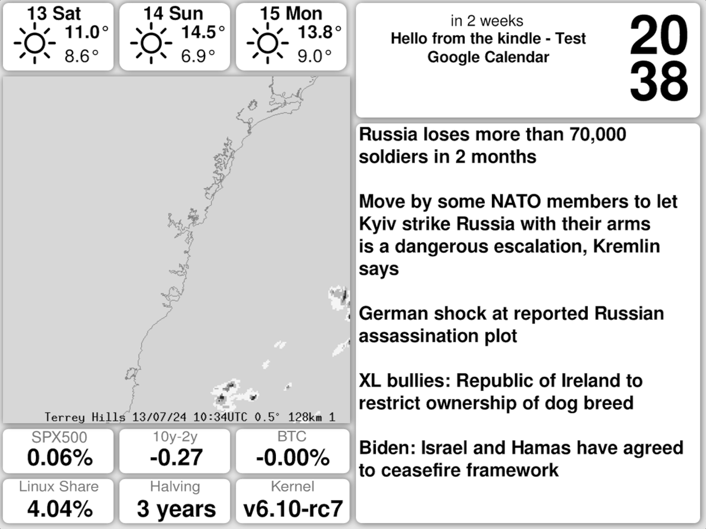

# Rusty Kindle

My personal standalone kindle dashboard made using rust.




## Features
 - 3 day weather prediction from [openweathermap](https://openweathermap.org/)
 - Local rain radar from [BOM](http://www.bom.gov.au/)
 - Financial data from [FRED](https://fred.stlouisfed.org/)
 - Current linux desktop share from [statscounter](https://gs.statcounter.com/os-market-share/desktop/worldwide)
 - Time till next bitcoin halving from [blockchain.info](https://blockchain.info)
 - Next event in my google calendar using the [google calendar api](https://console.cloud.google.com/apis/library/calendar-json.googleapis.com)
 - News from [r/worldnews](https://www.reddit.com/r/worldnews/)
 - Current time (hour on top, minute on bottom)
 - **Incredibly** non-future proof (more scraping than apis)

## Setup
This display is not really for "the general public", but if you live in australia (radar was only meant for aussies), have a kindle, and want a (likely) unstable dashboard, heres the setup:

### Requirements
You will need a jailbroken kindle with ssh enabled. Make sure that it has ```xrandr```, ```eips```, and ```tmux```. Should work on almost any kindle that has these scripts, but I've only tested on a kindle paperwhite 5th gen.

### Building
0. ```git clone``` this repo.
1. Install rust/cargo & [Cross](https://github.com/cross-rs/cross) and build the project with: ```RUSTFLAGS="-C target-feature=+crt-static" cross build --target arm-unknown-linux-musleabi --release```. This is the only reliable way of building for the kindle.

### Config
We have three things we needs to configure for all the information in the dashboard to be fetched. This information is stored in a folder named ```sensitive/```, which you should find at the root of the repo you just cloned, and is where the following will be (temporarily) stored.

1. **Google calendar** - Setup a google [OAuth Client ID](https://console.cloud.google.com/apis/credentials). Save the json client secret to sensitive/creds.json.  Make sure to add yourself as a test user and enable the [google-calendar api](https://console.cloud.google.com/apis/library/calendar-json.googleapis.com) (and set up the calendar scope...).

3. **OpenWeatherMap** - Create an [API](https://openweathermap.org/api) account. Save the api token in sensitive/openweatherkey.json as ```{"key":"MYKEY"}```

4. **Bom radar location** - Save the bom weather station (eg, IDR713 for Sydney) in sensitive/bom.json as ```{"station": "STATIONID"}```

### Moving

We will use scp and ssh to transfer the files.

**change KINDLE_ADDR to your kindle's address!**

1. SSH into your kindle: ```ssh root@KINDLE_ADDR```
2. (Likely) enable disk read/write: ```mntroot rw```
3. Create a folder that will hold our binary and the config files: ```mkdir /dash /dash/sensitive && cd /dash```
4. **Back on the host machine**, move our configs: ```scp -r sensitive/ root@KINDLE_ADDR:/dash/``` 
5. And our binary: ```scp target/arm-unknown-linux-musleabi/release/kindle root@KINDLE_ADDR:/dash/kindle_screen``` to the kindle

###  Running

0. SSH to the kindle 
1. Disable the status bar (if you have one?): ```lipc-set-prop com.lab126.pillow disableEnablePillow disable```
2. Turn off the backlight: ```echo -n 0 > /sys/devices/system/fl_tps6116x/fl_tps6116x0/fl_intensity```
2. Run: ```tmux```
3. Then, start the dashboard with: ```cd /dash/ && ./kindle_screen```
4. Check that all data could be fetched and no errors were shown. The kindle should clear it's screen and eventually show the dashboard.
5. Detach and leave running with ```ctrl+a```, then ```d```.

Wait while the kindle spends two minutes using all it's cpu cycles to render a 1200x900 svg every 15 minutes.

### Killing

1. On the kindle, run: ```killall kindle_screen``` and/or ```tmux kill-server```

## Caveats

 - You ***really* should** check through the logs on the initial run for any misconfigs / failed runs / incomplete data (step 3 of running).
 - The radar is scraped from BOM ("Australian" Bureau of Meteorology) - only Australian locations supported.
 - Very unstable and not future proof, but at least it shouldn't **all** break at the same time thanks to rust.
 - No "low power mode" with screenshots or sleepmode. Best to keep the kindle plugged in.

## TODO
 - Caching so we don't need to fetch the linux kernel version / weather / FRED data every 15 minutes.
 - Switching the calendar api to receiving updates rather than continous polling. 
 - Moving from tux to something like systemd.


## Personal Notes

This is my first "real" project in Rust. Expect bugs and poorly written code. Otherwise, I really like this language! I'm not really a *rust*acean, but I'm slowly getting there.

Also, for any others following in my footsteps, the kindle is more like an embedded device rather than a raspberry pi - don't expect a lot (if any) from it, and definately don't try web-engine based rendering.

## Stats

```git ls-files '**/*.rs' | xargs wc -l```

| Lines | File |
| ---: | :--- |
|  101 | src/calendar.rs |
|   90 | src/main.rs |
|   67 | src/news.rs |
|  121 | src/radar.rs |
|  610 | src/renderer.rs |
|   61 | src/stats.rs |
|   68 | src/stats/btc.rs |
|   29 | src/stats/halving.rs |
|   42 | src/stats/linear_rg.rs |
|   26 | src/stats/linux.rs |
|   27 | src/stats/linux_version.rs |
|   70 | src/stats/spx.rs |
|   64 | src/stats/yield_spread.rs |
|   60 | src/utils.rs |
|  120 | src/weather.rs |
| **1556** | **total** |